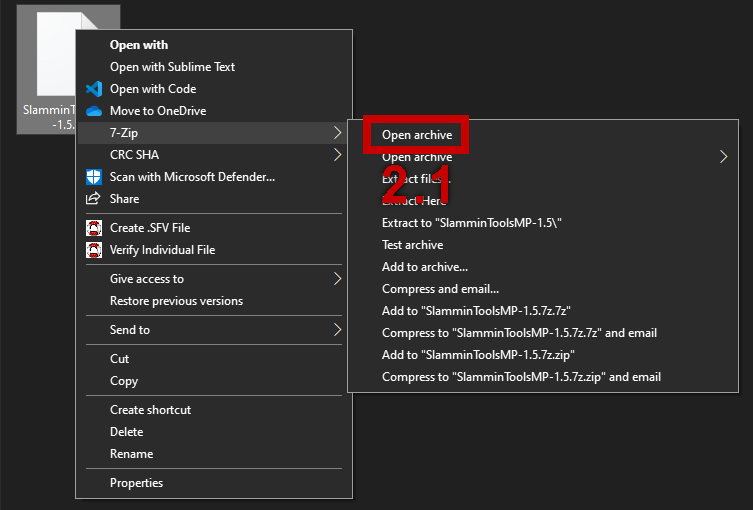
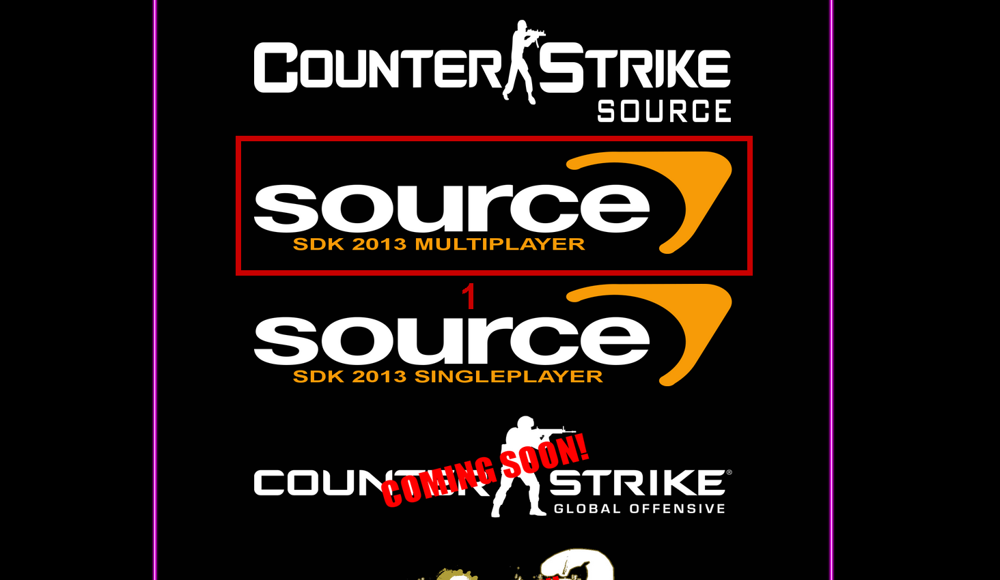
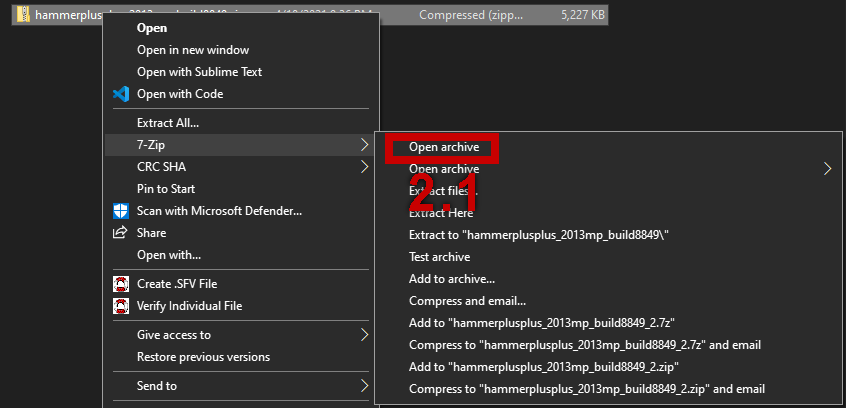

| Languages |
| --- |
| **en**, [ru](./lang/ru/), [pt-br](./lang/pt-br/)|

# How to use Hammer++ with Garry's Mod

## Why did I create this?
The answer is pretty simple... I hate myself. No, but really I saw a lot of people struggling to install Hammer++ itself but they had more problems with installing it for Garry's Mod, so this is a way I found to make it work.

## Requirements:
- A computer running Windows
- [7-Zip](https://www.7-zip.org/)
- [Garry's Mod](https://store.steampowered.com/app/4000)
- Source Games
	- [Counter-Strike: Source](https://store.steampowered.com/app/240)
	- [Half-Life 2](https://store.steampowered.com/app/220)
	- [Half-Life 2: Deathmatch](https://store.steampowered.com/app/320)
	- [Half-Life 2: Episode One](https://store.steampowered.com/app/380)
	- [Half-Life 2: Episode Two](https://store.steampowered.com/app/420)
	- [Half-Life 2: Lost Coast](https://store.steampowered.com/app/340)
	- (Optional) [INFRA](https://store.steampowered.com/app/251110)
	- (Optional) [Black Mesa](https://store.steampowered.com/app/362890)
- Source SDK 2013 Multiplayer
- (Optional) [Slammin' Tools](https://drive.google.com/drive/folders/17pQY8wDkednZi0kMZOSpAtNBNmFWm6GJ)
- [Hammer++](https://ficool2.github.io/HammerPlusPlus-Website/index.html)

**About Windows versions compatibility**  
Windows is required to run Hammer++, as other OSes are not fully supported by Valve thus hammer is not available for any other OS than Windows. When it comes to specific versions there is none, I have personally tested it on Windows 10 Pro version 20H2 build 19042.928 and all the versions until Windows 10 Pro version 21H2 build 19044.1526 (being the newest version available in public channel as of time of writing this). That being said, since I published this guide almost a year ago, people have followed it and succeeded in installing it on many diffrent Windows versions including Windows 11.

## How do I install the requirements?
In this tutorial, I assume you have Garry's Mod as well as all the source games I have mentioned installed and also 7-Zip installed.

### How to install Source SDK 2013 Multiplayer
1. Navigate to your steam library and make sure you have tools checked in your search filters
2. Open the `UNCATEGORIZED` category and find `Source SDK 2013 Multiplayer`, alternatively just search it
3. Click on the `INSTALL` button then on `NEXT` and wait for it to download

4. **YOU MUST RUN HAMMER FROM SOURCE SDK 2013 MULTIPLAYER NOW BEFORE CONTINUING** (The steps below explain how to do this)
5. Right click on `Source SDK 2013 Multiplayer`, hover over `Manage` and then click `Browse local files`

6. Navigate into the `bin` folder and double click `hammer.exe`. A small window should pop out, choose `Half-Life 2` from there.
7. When Hammer opens and fully initializes, close it


### (Optional) How to install Slammin' Tools?
**Slammin' Tools are not necessary but are a good thing to have, especially if you are compiling Statua's maps.**

1. Navigate to this [link](https://drive.google.com/drive/folders/17pQY8wDkednZi0kMZOSpAtNBNmFWm6GJ) and download the file ending with `.7z`

2. Once downloaded, open the archive and drag and drop the files into the `bin` folder of `Source SDK 2013 Multiplayer` (It'll ask you if you want to override some files, click yes.)


3. Now repeat steps `6` and `7` of installing `Source SDK 2013 Multiplayer`

## Installing and configuring Hammer++
Now without any more bullshitting as I already hate myself to the point of punching myself in the face, we get to the grand finale which is installing and configuring Hammer++.

### Installing
1. Navigate to this [link](https://ficool2.github.io/HammerPlusPlus-Website/pages/download.html) and download the version for `Source SDK 2013 Multiplayer`

2. Once downloaded, open the archive, navigate inside the folder you see and into the `bin` folder inside drag and drop the files into `bin` folder of `Source SDK 2013 Multiplayer`


3. Now repeat step `6` and `7` of installing `Source SDK 2013 Multiplayer`

### Configuring
This part of the tutorial will be text only, so read it very carefully as every step written here is very important.

1. Navigate into the root folder of `Source SDK 2013 Multiplayer` and open the folder named `hl2`
2. Open `gameinfo.txt` with a text editor of your choice
3. You're gonna need to add these lines into your `gameinfo.txt`, **don't forget to change "<Steam's common folder>" to proper path!**
Example: [link](https://github.com/RealParSec/realparsec.github.io/blob/master/README.md#example-gameinfotxt)

```
// Source games content
game				"<Steam's common folder>/GarrysMod/garrysmod/garrysmod.vpk"
game				"<Steam's common folder>/Half-Life 2/episodic/ep1_pak.vpk"
game				"<Steam's common folder>/Half-Life 2/ep2/ep2_pak.vpk"
game				"<Steam's common folder>/Half-Life 2/lostcoast/lostcoast_pak.vpk"
game				"<Steam's common folder>/Half-Life 2 Deathmatch/hl2mp/hl2mp_pak.vpk"
game				"<Steam's common folder>/Counter-Strike Source/cstrike/cstrike_pak.vpk"
game				"<Steam's common folder>/infra/infra/pak01.vpk"

// Black Mesa content - last time I checked a bit buggy in hammer++ and caused hammer++ to crash
game				"<Steam's common folder>/Black Mesa/bms/bms_materials.vpk"
game				"<Steam's common folder>/Black Mesa/bms/bms_models.vpk"
game				"<Steam's common folder>/Black Mesa/bms/bms_sound_vo_english.vpk"
game				"<Steam's common folder>/Black Mesa/bms/bms_sounds_misc.vpk"
game				"<Steam's common folder>/Black Mesa/bms/bms_textures.vpk"
```

You add them after those lines:

```
// Where the game's binaries are
gamebin				hl2/bin
platform			|all_source_engine_paths|platform
```

These lines mount contents from source games, list goes as follow
- Garry's Mod
- Counter-Strike: Source
- Half-Life 2: Episode One
- Half-Life 2: Episode Two
- Half-Life 2: Lost Coast
- Half-Life 2: Deathmatch
- Infra
- Black Mesa

4. Now navigate into the root folder of `Source SDK 2013 Multiplayer` and then into bin folder
5. Double click `hammerplusplus.exe` and when small window appear you have to choose `Half-Life 2`, yes you won't be adding `Garry's Mod` into that list
6. Once hammer is open you have to open `Tools` dropdown and from there choose `Options...`
7. New window will appear, click on `Game Configurations` and you will see small button `Add` click it
8. Navigate into your `Garry's Mod` root folder and then into `bin` folder and find there file called `garrysmod.fgd` and load it
9. Click on the `2D Views` tab and in `Options` section tick everything in the right column
10. In the `Build Programs` tab, you are going to change the path of `Game executable` to `<Garry's Mod root folder>/hl2.exe`
11. In the `Build Programs` tab, you are going to change the path of `Place compiled maps in this directory before running the game` to `<Garry's Mod root folder>/garrysmod/maps`
12. In `Hammer++`, disable Anisotropic Filtering

## Example `gameinfo.txt`

```
"GameInfo"
{
	game 		"HALF-LIFE 2"
	title 		"HALF-LIFE'"
	type		singleplayer_only
	supportsvr	1

	FileSystem
	{
		SteamAppId				220		// This will mount all the GCFs we need (240=CS:S, 220=HL2).
		
		//
		// The code that loads this file automatically does a few things here:
		//
		// 1. For each "Game" search path, it adds a "GameBin" path, in <dir>\bin
		// 2. For each "Game" search path, it adds another "Game" path in front of it with _<langage> at the end.
		//    For example: c:\hl2\cstrike on a french machine would get a c:\hl2\cstrike_french path added to it.
		// 3. For the first "Game" search path, it adds a search path called "MOD".
		// 4. For the first "Game" search path, it adds a search path called "DEFAULT_WRITE_PATH".
		//

		//
		// Search paths are relative to the base directory, which is where hl2.exe is found.
		//
		// |gameinfo_path| points at the directory where gameinfo.txt is.
		// We always want to mount that directory relative to gameinfo.txt, so
		// people can mount stuff in c:\mymod, and the main game resources are in
		// someplace like c:\program files\valve\steam\steamapps\half-life 2.
		//
		SearchPaths
		{
			// First, mount all user customizations.  This will search for VPKs and subfolders
			// and mount them in alphabetical order.  The easiest way to distribute a mod is to
			// pack up the custom content into a VPK.  To "install" a mod, just drop it in this
			// folder.
			//
			// Note that this folder is scanned only when the game is booted.
			game+mod			hl2/custom/*

			// We search VPK files before ordinary folders, because most files will be found in
			// VPK and we can avoid making thousands of file system calls to attempt to open files
			// in folders where they don't exist.  (Searching a VPK is much faster than making an operating
			// system call.)
			game_lv				hl2/hl2_lv.vpk
			game+mod			hl2/hl2_sound_vo_english.vpk
			game+mod			hl2/hl2_pak.vpk
			game				|all_source_engine_paths|hl2/hl2_textures.vpk
			game				|all_source_engine_paths|hl2/hl2_sound_misc.vpk
			game				|all_source_engine_paths|hl2/hl2_misc.vpk
			platform			|all_source_engine_paths|platform/platform_misc.vpk

			// Now search loose files.  We'll set the directory containing the gameinfo.txt file
			// as the first "mod" search path (after any user customizations).  This is also the one
			// that's used when writing to the "mod" path.
			mod+mod_write+default_write_path		|gameinfo_path|.

			// Add the HL2 directory as a game search path.  This is also where where writes
			// to the "game" path go.
			game+game_write		hl2

			// Where the game's binaries are
			gamebin				hl2/bin

			// Last, mount in shared HL2 loose files
			game				|all_source_engine_paths|hl2
			platform			|all_source_engine_paths|platform

			// Source games
			game				"|all_source_engine_paths|../GarrysMod/garrysmod/garrysmod.vpk"
			game				"|all_source_engine_paths|../Half-Life 2/episodic/ep1_pak.vpk"
			game				"|all_source_engine_paths|../Half-Life 2/ep2/ep2_pak.vpk"
			game				"|all_source_engine_paths|../Half-Life 2/lostcoast/lostcoast_pak.vpk"
			game				"|all_source_engine_paths|../Half-Life 2 Deathmatch/hl2mp/hl2mp_pak.vpk"
			game				"|all_source_engine_paths|../Counter-Strike Source/cstrike/cstrike_pak.vpk"
			game				"|all_source_engine_paths|../infra/infra/pak01.vpk"

			// Black Mesa content - last time I checked a bit buggy in hammer++ and caused hammer++ to crash
			//game				"|all_source_engine_paths|../Black Mesa/bms/bms_materials.vpk"
			//game				"|all_source_engine_paths|../Black Mesa/bms/bms_models.vpk"
			//game				"|all_source_engine_paths|../Black Mesa/bms/bms_sound_vo_english.vpk"
			//game				"|all_source_engine_paths|../Black Mesa/bms/bms_sounds_misc.vpk"
			//game				"|all_source_engine_paths|../Black Mesa/bms/bms_textures.vpk"


			// Other contents
			// game				"E:/gmod/maps/rp_riverden/content/"
		}
	}
}
```

## Last words
Now you are ready to use Hammer++ and it should work. The only problem is that you have to double mount contents as Hammer++ does not support the Garry's Mod mounting way for now. So, if you are using Hammer++ you are most probably familiar with `mount.cfg` of gmod, so to mount content into Hammer++ you have to mount it in the `gameinfo.txt` file you edited earlier and add it right after those lines you added earlier `game "<path to your content>"`. If you think that I could improve something then messege me on Github or you can ping me on discord (ParSec#4563) on the [Statua Mapping](https://discord.gg/3Uq4WKNRuF) server, I do recommend you drop by and say hello, a lot of people there can help you with a lot of your problems.

Now if you don't mind I'm gonna shoot myself in the face.
Oh and I couldn't forget about you CoolGuy for asking me everyday the same question when will I make it and reminding me how disorganized I am.
